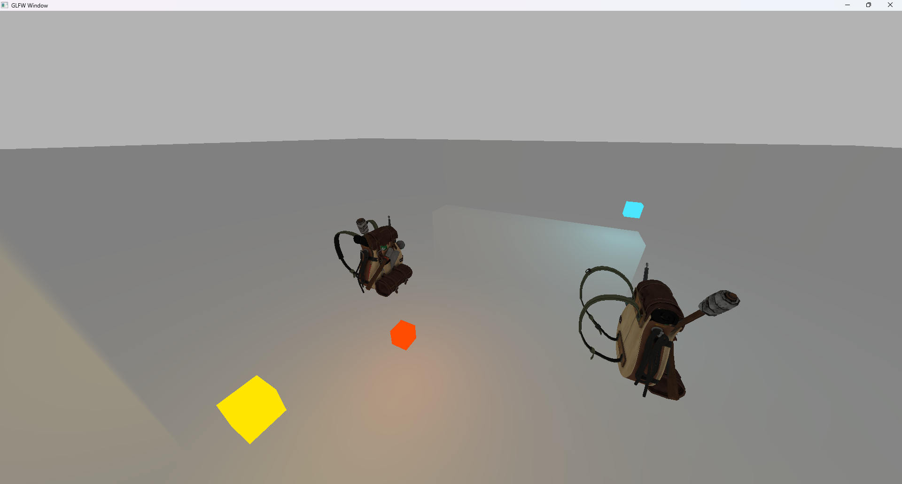

# ProjectFPS

## Purpose
To make a 3D First-Person Shooter game from scratch with documentations and plans to deepen my knowledge,
what I got in the university so far, and have a fully functional game.

## Tools
I'm going to use some libraries and APIs, especially for graphics.
- C++17
- OpenGL 4.3
- stb_image

For diagrams, I'm going to use [draw.io](https://draw.io)

## Concept
The project concept is to make a Quake-ish game with own implemented collision detection and physics engine.
The player's goal is to destroy every enemy, get the key and get to the end of the map.
 On the maps there's going to be pickup able health packs, ammunition, extra weapons, and the key to the exit.
### There will be two types of enemies: 
- zombie-like which runs towards to player and cause melee damage
- shooter which shoots at the player

If the player dies, the map restarts.

## Stages
There's going to be multiple stages of the development.

### Stages with Checklist

#### 1. Basic Prototype
Goal is to make a simple "Game" where you can walk around and load different map
- [X] OpenGL window with GLFW
- [X] FPS camera
- [X] Input system
- [X] 3D Graphics
- [X] Basic Lighting
- [X] Scene
- [ ] Player controller
- [ ] Collision with static geometry (BVH)
- [X] Load basic level (Wavefront OBJ)
- [ ] Basic physics
- [ ] Debug overlay

### 2. FPS Prototype
Goal is to implement basic shooting, pickup ables
- [ ] Basic shooting
- [ ] Health system
- [ ] Pickup ables (health pack, ammunition, etc.)
- [ ] GUI

### 3. Enemies
TODO
### 4. Menu System
TODO
### 5. Settings
TODO